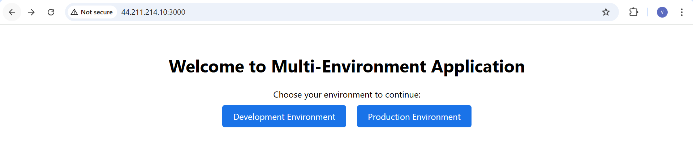

# Multi-Environment Application Deployment

This project demonstrates a multi-environment application with separate development and production backends, and a frontend service.

## Project Structure
```bash
multiEnv/
├── docker-compose.yml
├── backend/
│ ├── dev/
│ │ ├── app.py
│ │ ├── requirements.txt
│ │ ├── Dockerfile
│ │ └── .env
│ └── prod/
│ ├── app.py
│ ├── requirements.txt
│ ├── Dockerfile
│ └── .env
└── frontend/
├── src/
├── public/
├── Dockerfile
├── nginx.conf
└── package.json


## Prerequisites

- Docker 20.10+
- Docker Compose 1.29+
- 4GB RAM available for Docker

## Deployment

### 1. Clone the repository (if not already done)
```bash
git clone <repository-url>
cd multiEnv

# Option 1: Build first, then run in detached mode
docker-compose build
docker-compose up -d

# Option 2: Combined command
docker-compose up --build -d

Accessing the Application
Frontend Dashboard: http://44.211.214.10:3000




Development Backend: http://44.211.214.10:3000/dev

Production Backend: http://44.211.214.10:3000/prod

Direct Backend Access:

Development: http://44.211.214.10:3001

Production: http://44.211.214.10t:3002
